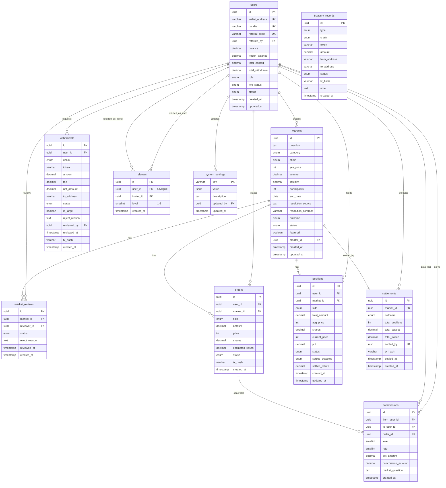

# FutureX Database ER Diagram v1.0

> 基于 PostgreSQL (Supabase) | 11 张表 | 2026-06-08

## 实体关系图 (Mermaid)

## 表关系总结

| 父表 | 子表 | 关系 | 外键 |
|------|------|------|------|
| users | markets | 1:N | creator_id |
| users | market_reviews | 1:N | reviewer_id |
| users | orders | 1:N | user_id |
| users | positions | 1:N | user_id |
| users | settlements | 1:N | settled_by |
| users | withdrawals | 1:N | user_id, reviewed_by |
| users | referrals | 1:N (双向) | user_id, inviter_id |
| users | commissions | 1:N (双向) | from_user_id, to_user_id |
| users | system_settings | 1:N | updated_by |
| markets | market_reviews | 1:N | market_id |
| markets | orders | 1:N | market_id |
| markets | positions | 1:N | market_id |
| markets | settlements | 1:1 | market_id |
| orders | commissions | 1:N | order_id |

## 索引清单

| 表 | 索引 | 类型 |
|----|------|------|
| users | wallet_address | UNIQUE |
| users | handle | UNIQUE |
| users | referral_code | UNIQUE |
| users | referred_by, role, status | BTREE |
| markets | category, chain, status, end_date | BTREE |
| markets | featured (partial) | BTREE |
| markets | question | GIN (全文搜索) |
| market_reviews | market_id, reviewer_id, status | BTREE |
| orders | (user_id, created_at), market_id, status | BTREE |
| positions | (user_id, market_id, side) WHERE open | UNIQUE |
| settlements | market_id, settled_at | BTREE |
| withdrawals | (user_id, created_at), status, is_large | BTREE |
| referrals | inviter_id, level | BTREE |
| commissions | (to_user_id, created_at), from_user_id, order_id, level | BTREE |
| treasury_records | type, chain, status, created_at | BTREE |
